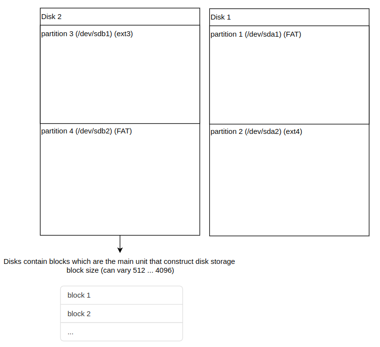

# File Systems

## Contents

- [Contents](#contents)
- [Introduction](#introduction)
  - [What is a file system?](#what-is-a-file-system)
    - [Introduction](#introduction-1)
    - [Virtual File System (VFS)](#virtual-file-system-vfs)
      - [File-system commands](#file-system-commands)
    - [Single directory hierarchy](#single-directory-hierarchy)
  - [Mount points and mount command](#mount-points-and-mount-command)
- [Linux file-system Example (ext2)](#linux-file-system-example-ext2)
  - [Disk and partitions](#disk-and-partitions)
  - [I-nodes](#i-nodes)
  - [Journaling File Systems](#journaling-file-systems)
- [Vfat file-system tutorial](#vfat-file-system-tutorial)
- [Virtual Filesystems](#virtual-filesystems)
  - [Procfs](#procfs)
  - [Sysfs](#sysfs)
  - [Tmpfs](#tmpfs)
  - [Debugfs](#debugfs)
- [File system in Userspace (FUSE)](#file-system-in-userspace-fuse)

## Introduction

Describe what file system is ? then go through how the user see different file systems and how he uses it ? then we go and see how ext2 file system id organizing things on linux? then we see another implementation of simple file-system (vfat)? then we see other virtual filesystems? then we try to develop our own file-system in the user space.

we use different sources to implement this tutorial.

- [kernel-laps-filesystem management](https://linux-kernel-labs.github.io/refs/heads/master/lectures/fs.html)
- ch 13 and ch14 in [The Linux programming interface](https://www.amazon.com/Linux-Programming-Interface-System-Handbook/dp/1593272200) 

## What is a file system?

A file system is a way to organize files and directories on a storage devices(HDD, SSD or flash memory).

There are many types of files systems like: FAT, ext2, ext3, ext4, nfs, ...

HDD, SSD, emmc, UFS can be partitioned to different partitions using `fdisk` or `cfdisk` and each partition can have a it's specific file system.



Each Disk is represented in user space as a device:

| Device Type         | Device Name in `/dev/` | Description                                                  |
| ------------------- | ---------------------- | ------------------------------------------------------------ |
| SATA/SCSI HDD & SSD | `/dev/sdX`             | Traditional hard drives (HDDs) and solid-state drives (SSDs) attached via SATA, SAS, or SCSI controllers. `X` represents a drive letter (e.g., `/dev/sda`, `/dev/sdb`). |
| SATA/SCSI Partition | `/dev/sdXN`            | Partitions on a SATA/SCSI drive (e.g., `/dev/sda1`, `/dev/sda2`). |
|                     |                        |                                                              |


### Ex.  partitioning file(memory space) into two partitions one FAT and one ext2

1. **create a 1GB file filled with zeros `sd.img`**

```sh
dd if=/dev/zero of=sd.img bs=1M count=1024
```

> 1024+0 records in
> 1024+0 records out
> 1073741824 bytes (1.1 GB, 1.0 GiB) copied, 0.585817 s, 1.8 GB/s

2. **create partitions inside this SD-card simulated file**

```sh 
cfdisk sd.img
# dos
```

- one partition 64MB / FAT16 / bootable
- one partition 200MB / linux / for root filesystem
- one partition that fills the rest of the SD card image / QNX.4 /data file system 
- then `write` to apply changes

3. **use loop driver to emulate this file as a block device. This will enable accessing, writing and reading to and from this file(emulated block device).**

   ```sh
   sudo losetup -f --show --partscan sd.img
   ```

   > /dev/loop25

   - -f: finds a free loop device
   - --show: show the loop device that is used
   - --partscan: scans the loop device for partitions and creates additional /dev/loop\<x>p\<y> block devices
   - note: a **loop device** is a regular file or device that is mounted as a file system. It may be thought of as a "pseudo device" because the operating system kernel treats the file's contents as a block device.


### Virtual File System (VFS)

#### File-system system calls

## Linux file-system Example (ext2)

### Disk and partitions

### I-nodes

### Journaling File Systems

## Vfat file-system tutorial

## Virtual Filesystems

### Procfs

### Sysfs

### Tmpfs

### Debugfs

## File system in Userspace (FUSE)

