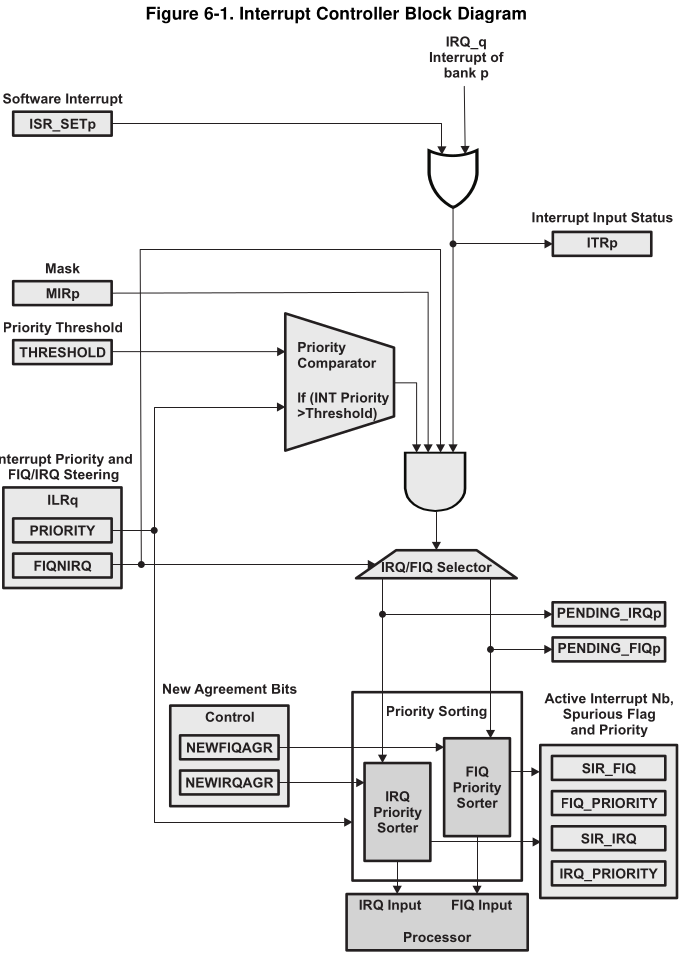

# BeagleBone Black – GPIO Interrupt (Stage 1)

## Hardware
- Button between P9_12 (GPIO1_28) and GND

## Build
. ../../../../prepareEnv/bb-setup/setup_bb.sh
make

## Load
sudo cp gpio_irq.ko ""/srv/nfs4/bb_busybox/lib/modules/"
ssh root@192.168.1.107 "modeprobe gpio_irq"

ssh root@192.168.1.107 insmod /lib/modules/gpio_irq.ko


## Test
Press the button and run:
dmesg
cat /proc/interrupts | grep gpio


# problems

```sh
setenv serverip 192.168.1.11; setenv ipaddr 192.168.1.107; tftpboot 88000000 am335x-boneblack.dtb; tftpboot ${fdtoverlay_addr_r} p9_12-gpio.dtbo; tftpboot 0x82000000 zImage_native_bb; fdt addr 88000000; fdt resize 8192; fdt apply ${fdtoverlay_addr_r};  bootz 0x82000000 - 88000000;
```

```
cd /srv/tftp/
dtc -I dtb -O dts -o am335x-boneblack.dts am335x-boneblack.dtb

cat /sys/kernel/debug/pinctrl/44e10800.pinmux-pinctrl-single/pins
```

## build another dts

CONFIG_SOC_AM33XX


# BB Interrupts


