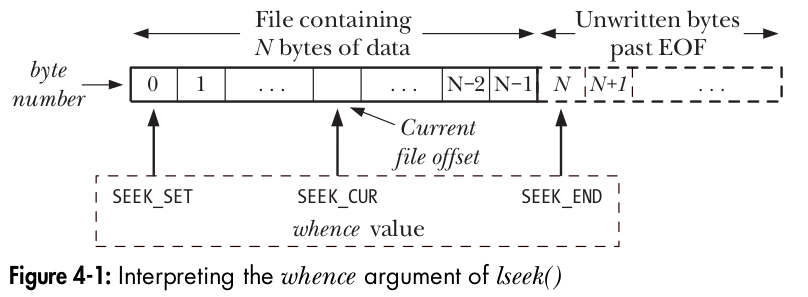

# File Handling in Linux

## Introduction

- The primary mechanism in Linux for dealing with input/output operations is through files.
- All file types in Linux are treated as files, including:
  - **Regular files**
  - **Device files**
  - **Terminals**
  - **Sockets**
  - **FIFOs/Pipes**

## File Descriptor

- A **File Descriptor** is an integer value assigned by the kernel for every file opened by a process.
- Each process has its own set of **File Descriptors**, which are used to manage file operations.
- you can see the open files for each process under `ls /proc/<pid>/fd/`

## Standard File Descriptors

- There are three standard file descriptors:

  - **0**: Standard Input (`stdin`)
  - **1**: Standard Output (`stdout`)
  - **2**: Standard Error (`stderr`)

- They are opened with each process by default

- `ls /dev/fd` current files descriptors for current process **x86 shell**

  > lrwx------ 1 dell dell 64 ديس 27 07:13 0 -> /dev/pts/7
  > lrwx------ 1 dell dell 64 ديس 27 07:13 1 -> /dev/pts/7
  > lrwx------ 1 dell dell 64 ديس 27 07:13 2 -> /dev/pts/7
  > lr-x------ 1 dell dell 64 ديس 27 07:13 3 -> /proc/107995/fd

  - try `cat /dev/pts/7` in the same shell (stdout)
  - from other shell try `echo "hellooooooooooo" >/dev/pts/7` (stdin)

- For devices `/dev` use the `ttyUSB0` for demonstration of how we write and read from devices through files 

## File System Calls

The following system calls are used for file operations such as reading and writing:

1. **`open(pathname, flags, mode)`** [man](https://man7.org/linux/man-pages/man2/open.2.html)

   - Opens a file and returns a file descriptor (`fd`) if successful.
   - On failure, returns `-1`.

2. **`read(fd, buffer, count)`** [man](https://man7.org/linux/man-pages/man2/read.2.html)

   - Reads `count` bytes from the file referred to by the file descriptor `fd` into the memory buffer `buffer`.
   - Returns the number of bytes actually read. If an error occurs, it returns `-1`. If the end of the file is reached, it returns `0`.

3. **`write(fd, buffer, count)`** [man](https://man7.org/linux/man-pages/man2/write.2.html)

   - Writes `count` bytes from the buffer `buffer` to the file referred to by the file descriptor `fd`.
   - Returns the number of bytes actually written. If an error occurs, it returns `-1`.

4. **`close(fd)`**  [man](https://man7.org/linux/man-pages/man2/close.2.html)

   - Closes the file associated with the file descriptor `fd`.
   - Returns `0` on success. On failure, returns `-1`.

5. **`off_t lseek(int fd, off_t offset, int whence)`** [man](https://man7.org/linux/man-pages/man2/lseek.2.html)

   - The `lseek()` system call adjusts the **file offset** of the open file referred to by the file descriptor `fd`, according to the values specified in `offset` and `whence`.

   - The whence argument indicates the base point from which offset is to be interpreted, and is one of the following values:

     - **SEEK_SET**
       The file offset is set offset bytes from the beginning of the file.
     - **SEEK_CUR**
       The file offset is adjusted by offset bytes relative to the current file offset.
     - **SEEK_END**
       The file offset is set to the size of the file plus offset. In other words, offset is
       interpreted with respect to the next byte after the last byte of the file.

     

6. **`int ioctl(int fd, int request, ... /* argp */)`** [man](https://man7.org/linux/man-pages/man2/ioctl.2.html)

   - The `ioctl()` system call is a catchall for device and file operations that don’t fit into the standard file I/O model.
   - The `fd` argument is an open file descriptor for the device or file upon which the control operation specified by `request` is to be performed. Device-specific header files define constants that can be passed in the request argument `... /* argp */`  [variable arguments](https://www.geeksforgeeks.org/variable-length-argument-c/).

7. **`int fcntl(int fd, int cmd, ...)`** [man](https://man7.org/linux/man-pages/man2/fcntl.2.html)

   - The `fcntl()` system call performs a range of control operations on an open file descriptor.
   - The `cmd` argument can specify a wide range of operations.
   - `...` [variable arguments](https://www.geeksforgeeks.org/variable-length-argument-c/)

# Exercise: File Handling in Linux

## Instructions

create file `io_syscalls.c`
```c
#include <stdio.h>
#include <stdlib.h>
#include <fcntl.h>
#include <unistd.h>
#include <string.h>
#include <sys/ioctl.h>

void print_usage(const char *prog_name) {
    printf("Usage: %s <file> <operation> <buffer> [<offset>]\n", prog_name);
    printf("Operations:\n");
    printf("  read\n");
    printf("  write\n");
    printf("  lseek\n");
}

int main(int argc, char *argv[]) {
    if (argc < 4) {
        print_usage(argv[0]);
        return 1;
    }

    const char *file_path = argv[1];
    const char *operation = argv[2];
    const char *buffer = argv[3];
    int offset = (argc == 5) ? atoi(argv[4]) : 0;

    int fd = open(file_path, O_RDWR | O_CREAT, 0644);
    if (fd == -1) {
        perror("open");
        return 1;
    }

    if (strcmp(operation, "read") == 0) {
        char read_buf[1024];
        ssize_t bytes_read = read(fd, read_buf, sizeof(read_buf) - 1);
        if (bytes_read == -1) {
            perror("read");
            close(fd);
            return 1;
        }
        read_buf[bytes_read] = '\0';
        printf("Read: %s\n", read_buf);
    } else if (strcmp(operation, "write") == 0) {
        ssize_t bytes_written = write(fd, buffer, strlen(buffer));
        if (bytes_written == -1) {
            perror("write");
            close(fd);
            return 1;
        }
        printf("Written: %s\n", buffer);
    } else if (strcmp(operation, "lseek") == 0) {
        off_t new_offset = lseek(fd, offset, SEEK_SET);
        if (new_offset == (off_t)-1) {
            perror("lseek");
            close(fd);
            return 1;
        }
        printf("Seeked to offset: %ld\n", new_offset);

        char read_buf[1024];
        ssize_t bytes_read = read(fd, read_buf, sizeof(read_buf) - 1);
        if (bytes_read == -1) {
            perror("read");
            close(fd);
            return 1;
        }
        read_buf[bytes_read] = '\0';
        printf("Read after seek: %s\n", read_buf);
    } else {
        print_usage(argv[0]);
        close(fd);
        return 1;
    }

    close(fd);
    return 0;
}
```

### 1. Write read, lseek syscalls
- compile this programs 
  `gcc io_syscalls.c -o io_syscalls`

- `./io_syscalls test write "1234567890"`

  > Written: 1234567890

  check the generated file test

- `./io_syscalls test read ""`

  > Read: 1234567890

  same as `cat test`

- `./io_syscalls test lseek "" 5`

  > Seeked to offset: 5
  > Read after seek: 67890

- `./io_syscalls test lseek_write "01234567890" 5`

  > Seeked to offset: 5
  > Written after seek: 01234567890

  - `./io_syscalls test read ""`

    > Read: 1234501234567890

### 2. getopt & reading proc files

create file `io_syscalls_getopt.c`

```c
#include <stdio.h>
#include <stdlib.h>
#include <fcntl.h>
#include <unistd.h>
#include <string.h>
#include <sys/ioctl.h>
#include <getopt.h>

void print_usage(const char *prog_name) {
    printf("Usage: %s -f <file> -o <operation> -b <buffer> [-s <offset>]\n", prog_name);
    printf("Operations:\n");
    printf("  read\n");
    printf("  write\n");
    printf("  lseek\n");
    printf("  lseek_write\n");
}

int main(int argc, char *argv[]) {
    const char *file_path = NULL;
    const char *operation = NULL;
    const char *buffer = NULL;
    int offset = 0;

    int opt;
    while ((opt = getopt(argc, argv, "f:o:b:s:")) != -1) {
        switch (opt) {
            case 'f':
                file_path = optarg;
                break;
            case 'o':
                operation = optarg;
                break;
            case 'b':
                buffer = optarg;
                break;
            case 's':
                offset = atoi(optarg);
                break;
            default:
                print_usage(argv[0]);
                return 1;
        }
    }

    if (!file_path || !operation) {
        print_usage(argv[0]);
        return 1;
    }

    int fd = open(file_path, O_RDWR, 0644);
    if (fd == -1) {
        perror("open");
        return 1;
    }

    if (strcmp(operation, "read") == 0) {
        char read_buf[1024];
        ssize_t bytes_read = read(fd, read_buf, sizeof(read_buf) - 1);
        if (bytes_read == -1) {
            perror("read");
            close(fd);
            return 1;
        }
        read_buf[bytes_read] = '\0';
        printf("Read: %s\n", read_buf);
    } else if (strcmp(operation, "write") == 0) {
        ssize_t bytes_written = write(fd, buffer, strlen(buffer));
        if (bytes_written == -1) {
            perror("write");
            close(fd);
            return 1;
        }
        printf("Written: %s\n", buffer);
    } else if (strcmp(operation, "lseek") == 0) {
        off_t new_offset = lseek(fd, offset, SEEK_SET);
        if (new_offset == (off_t)-1) {
            perror("lseek");
            close(fd);
            return 1;
        }
        printf("Seeked to offset: %ld\n", new_offset);

        char read_buf[1024];
        ssize_t bytes_read = read(fd, read_buf, sizeof(read_buf) - 1);
        if (bytes_read == -1) {
            perror("read");
            close(fd);
            return 1;
        }
        read_buf[bytes_read] = '\0';
        printf("Read after seek: %s\n", read_buf);
    } else if (strcmp(operation, "lseek_write") == 0) {
        off_t new_offset = lseek(fd, offset, SEEK_SET);
        if (new_offset == (off_t)-1) {
            perror("lseek");
            close(fd);
            return 1;
        }
        printf("Seeked to offset: %ld\n", new_offset);

        ssize_t bytes_written = write(fd, buffer, strlen(buffer));
        if (bytes_written == -1) {
            perror("write");
            close(fd);
            return 1;
        }
        printf("Written after seek: %s\n", buffer);
    } else {
        print_usage(argv[0]);
        close(fd);
        return 1;
    }

    close(fd);
    return 0;
}
```

- This is used in alot of open source projects 

Note the change in options to call the application 

- compile using `gcc io_syscalls_getopt.c -o io_syscalls_getopt`

- `./io_syscalls_getopt -f test -o read -b "01234567890"` 

  > Read: 1234501234567890

- `./io_syscalls_getopt -f /proc/cpuinfo -o read -b "01234567890"`

### 3. ioctl

our driver store value and get values using commands, to store a value

1. `#define IOCTL_GET_VALUE _IOR('a', 1, int *)`

2. `#define IOCTL_SET_VALUE _IOW('a', 2, int *)`

- The macros describing this structure live in `<asm/ioctl.h>` are `_IO(type,nr)` and `{_IOR,_IOW,_IOWR}(type,nr,size)`.

#### {_IOR,_IOW,_IOWR}(type,nr,size) Parameters:

- **type**:
  - A unique identifier (usually a character) for the device or driver.
  - Example: `'M'` for a media device.
- **nr**:
  - Command number, a unique identifier for the specific operation.
  - Example: `1`, `2`, `3`.
- **size**:
  - The size of the data structure being passed, typically determined with `sizeof()`.
  - Example: `sizeof(struct my_data)`.


create a file `ioctl_userApp.c` to run on `/dev/my_device` file created by the kernel module `ioctl_kmodule`

```c
#include <stdio.h>
#include <fcntl.h>
#include <sys/ioctl.h>

#define DEVICE_TYPE 'M' // Unique identifier for the device

// Define ioctl commands
#define IOCTL_READ  _IOR(DEVICE_TYPE, 1, int)       // Read an integer
#define IOCTL_WRITE _IOW(DEVICE_TYPE, 2, int)       // Write an integer
#define IOCTL_RDWR  _IOWR(DEVICE_TYPE, 3, struct my_data) // Read/Write struct

struct my_data {
    int val1;
    int val2;
};

int main() {
    int fd = open("/dev/my_device", O_RDWR);
    if (fd < 0) {
        perror("Failed to open device");
        return 1;
    }

    int value = 0;
    struct my_data data = {10, 20};

    // Read an integer
    if (ioctl(fd, IOCTL_READ, &value) == 0) {
        printf("Value read from device: %d\n", value);
    }

    // Write an integer
    value = 100;
    if (ioctl(fd, IOCTL_WRITE, &value) == 0) {
        printf("Value written to device: %d\n", value);
    }

    // Read/Write a struct
    if (ioctl(fd, IOCTL_RDWR, &data) == 0) {
        printf("Modified data: val1=%d, val2=%d\n", data.val1, data.val2);
    }

    close(fd);
    return 0;
}
```


create file for the module `ioctl_kmodule.c` and cross compile for target using makefile in `module/` then on target insert in system using `insmod ioctl_kmodule` then `mknod /dev/my_device c <major> <minor> ` 

```sh
#include <linux/module.h>
#include <linux/fs.h>
#include <linux/uaccess.h>
#include <linux/cdev.h>

#define DEVICE_NAME "my_device"
#define DEVICE_TYPE 'M' // Unique identifier for the device

// Define ioctl commands
#define IOCTL_READ  _IOR(DEVICE_TYPE, 1, int)       // Read an integer
#define IOCTL_WRITE _IOW(DEVICE_TYPE, 2, int)       // Write an integer
#define IOCTL_RDWR  _IOWR(DEVICE_TYPE, 3, struct my_data) // Read/Write struct


struct my_data {
    int val1;
    int val2;
};
static int device_open(struct inode *, struct file *);
static int device_release(struct inode *, struct file *);
static long device_ioctl(struct file *, unsigned int, unsigned long);

static struct file_operations fops = {
    .open = device_open,
    .release = device_release,
    .unlocked_ioctl = device_ioctl,
};

static struct cdev c_dev;
static dev_t dev_num;

static int __init example_init(void) {
    if (alloc_chrdev_region(&dev_num, 0, 1, DEVICE_NAME) < 0) {
        return -1;
    }
    cdev_init(&c_dev, &fops);
    if (cdev_add(&c_dev, dev_num, 1) == -1) {
        unregister_chrdev_region(dev_num, 1);
        return -1;
    }
    printk(KERN_INFO "Example device registered with major %d\n", MAJOR(dev_num));
    return 0;
}

static void __exit example_exit(void) {
    cdev_del(&c_dev);
    unregister_chrdev_region(dev_num, 1);
    printk(KERN_INFO "Example device unregistered\n");
}

static int device_open(struct inode *inode, struct file *file) {
    printk(KERN_INFO "Device opened\n");
    return 0;
}

static int device_release(struct inode *inode, struct file *file) {
    printk(KERN_INFO "Device closed\n");
    return 0;
}

static long device_ioctl(struct file *file, unsigned int cmd, unsigned long arg) {
    int value;
    struct my_data data;

    switch (cmd) {
        case IOCTL_READ:
            value = 42; // Example: return 42
            if (copy_to_user((int __user *)arg, &value, sizeof(value))) {
                return -EFAULT;
            }
            break;

        case IOCTL_WRITE:
            if (copy_from_user(&value, (int __user *)arg, sizeof(value))) {
                return -EFAULT;
            }
            pr_info("Value written by user: %d\n", value);
            break;

        case IOCTL_RDWR:
            if (copy_from_user(&data, (struct my_data __user *)arg, sizeof(data))) {
                return -EFAULT;
            }
            pr_info("Data received: val1=%d, val2=%d\n", data.val1, data.val2);

            data.val1 += 10; // Modify the data
            data.val2 += 20;
            if (copy_to_user((struct my_data __user *)arg, &data, sizeof(data))) {
                return -EFAULT;
            }
            break;

        default:
            return -EINVAL;
    }

    return 0;
}

MODULE_LICENSE("GPL");
MODULE_AUTHOR("Example Author");
MODULE_DESCRIPTION("Example ioctl device driver");

module_init(example_init);
module_exit(example_exit);
```


- then cross compile `ioctl_userApp.c` for the target  Ex. `arm-cortex_a8-linux-gnueabihf-gcc ioctl_userApp.c -o ioctl_userApp` 

- copy to target Ex. `cp ioctl_userApp /srv/nfs4/nfsroot_bb/root`

- then run on target using `./ioctl_userApp` 

  > [ 1651.994043] Device opened
  > Value read from device: 42[ 1652.020430] Value written by user: 100
  >
  > Value written to device: 100[ 1652.029927] Data received: val1=10, val2=20
  >
  > Modified data: val1=20, val2=40[ 1652.036765] Device closed

### 4. fcntl(int fd, int op, ... /* arg */ ) 

[man](https://man7.org/linux/man-pages/man2/fcntl.2.html)

The `fcntl()` system call performs a range of control operations on an open file descriptor `fd`.

The `fcntl()` can take an optional third argument.  Whether or not this argument is required is determined by `op`.

```c
#include <stdio.h>
#include <stdlib.h>
#include <fcntl.h>
#include <unistd.h>
#include <errno.h>

int main() {
    int fd;
    struct flock lock;

    // Open a file
    fd = open("example.txt", O_RDWR | O_CREAT, 0666);
    if (fd == -1) {
        perror("open");
        exit(EXIT_FAILURE);
    }

    // Get file status flags
    int flags = fcntl(fd, F_GETFL);
    if (flags == -1) {
        perror("fcntl");
        close(fd);
        exit(EXIT_FAILURE);
    }
    printf("File status flags: %d\n", flags);

    // Set file status flags
    flags |= O_APPEND;
    if (fcntl(fd, F_SETFL, flags) == -1) {
        perror("fcntl");
        close(fd);
        exit(EXIT_FAILURE);
    }
    printf("File status flags set to append mode\n");

    // Get file descriptor flags
    int fd_flags = fcntl(fd, F_GETFD);
    if (fd_flags == -1) {
        perror("fcntl");
        close(fd);
        exit(EXIT_FAILURE);
    }
    printf("File descriptor flags: %d\n", fd_flags);

    // Set file descriptor flags
    fd_flags |= FD_CLOEXEC;
    if (fcntl(fd, F_SETFD, fd_flags) == -1) {
        perror("fcntl");
        close(fd);
        exit(EXIT_FAILURE);
    }
    printf("File descriptor flags set to close-on-exec\n");

    // Set a write lock on the file
    lock.l_type = F_WRLCK;
    lock.l_whence = SEEK_SET;
    lock.l_start = 0;
    lock.l_len = 0; // Lock the whole file
    if (fcntl(fd, F_SETLK, &lock) == -1) {
        perror("fcntl");
        close(fd);
        exit(EXIT_FAILURE);
    }
    printf("Write lock set on the file\n");

    // Release the lock
    lock.l_type = F_UNLCK;
    if (fcntl(fd, F_SETLK, &lock) == -1) {
        perror("fcntl");
        close(fd);
        exit(EXIT_FAILURE);
    }
    printf("Lock released\n");

    // Close the file
    close(fd);
    return 0;
}
```

This example demonstrates how to use `fcntl` to:

1. Get and set file status flags.
2. Get and set file descriptor flags.
3. Set and release a write lock on a file.

#### Write lock

A write lock, also known as an exclusive lock, is used to prevent other processes from reading or writing to a file while the lock is held. When a write lock is set on a file, it ensures that only the process that holds the lock can write to the file, and no other process can read or write to it until the lock is released.

This is useful for ensuring data consistency and preventing race conditions when multiple processes need to access the same file.

Here is a brief summary of the steps to set a write lock using `fcntl`:

1. Open the file using the `open` system call.
2. Initialize a `struct flock` structure and set its `l_type` field to `F_WRLCK`.
3. Use the `fcntl` system call with the `F_SETLK` command to apply the lock.
4. Perform the necessary file operations while the lock is held.
5. Release the lock by setting the `l_type` field to `F_UNLCK` and using `fcntl` again with the `F_SETLK` command.

### 5. readv & writev

[man](https://man7.org/linux/man-pages/man2/readv.2.html)

The `readv()` and `writev()` system calls perform scatter-gather I/O

The `readv()` system call works just like `read()` except that multiple buffers are filled.
The `writev()` system call works just like `write()` except that multiple buffers are written out.

```c
#include <sys/uio.h>
// Returns number of bytes read, 0 on EOF, or –1 on error
ssize_t readv(int fd, const struct iovec *iov, int iovcnt);

// Returns number of bytes written, or –1 on error
ssize_t writev(int fd, const struct iovec *iov, int iovcnt);
```

Example: 

```c
#include <stdio.h>
#include <stdlib.h>
#include <fcntl.h>
#include <unistd.h>
#include <sys/uio.h>
#include <string.h>

void usage(const char *progname) {
    fprintf(stderr, "Usage: %s <filename>\n", progname);
    exit(EXIT_FAILURE);
}

int main(int argc, char *argv[]) {
    if (argc != 2) {
        usage(argv[0]);
    }

    const char *filename = argv[1];
    int fd;
    struct iovec iov[2];
    ssize_t nr;

    // Data to write
    char *buf1 = "Hello, ";
    char *buf2 = "world!\n";

    // Open the file for writing
    fd = open(filename, O_WRONLY | O_CREAT | O_TRUNC, 0666);
    if (fd == -1) {
        perror("open");
        exit(EXIT_FAILURE);
    }

    // Initialize the iovec structures for writing
    iov[0].iov_base = buf1;
    iov[0].iov_len = strlen(buf1);
    iov[1].iov_base = buf2;
    iov[1].iov_len = strlen(buf2);

    // Write the data
    nr = writev(fd, iov, 2);
    if (nr == -1) {
        perror("writev");
        close(fd);
        exit(EXIT_FAILURE);
    }
    printf("Wrote %zd bytes\n", nr);

    close(fd);

    // Open the file for reading
    fd = open(filename, O_RDONLY);
    if (fd == -1) {
        perror("open");
        exit(EXIT_FAILURE);
    }

    // Buffers to read into
    char buf3[7];
    char buf4[7];

    // Initialize the iovec structures for reading
    iov[0].iov_base = buf3;
    iov[0].iov_len = sizeof(buf3) - 1;
    iov[1].iov_base = buf4;
    iov[1].iov_len = sizeof(buf4) - 1;

    // Read the data
    nr = readv(fd, iov, 2);
    if (nr == -1) {
        perror("readv");
        close(fd);
        exit(EXIT_FAILURE);
    }
    printf("Read %zd bytes\n", nr);

    // Null-terminate the buffers
    buf3[iov[0].iov_len] = '\0';
    buf4[iov[1].iov_len] = '\0';

    printf("Read data: '%s%s'\n", buf3, buf4);

    close(fd);
    return 0;
}
```

`./readv_writev log.txt`

> Wrote 14 bytes
> Read 12 bytes
> Read data: 'Hello, world'
