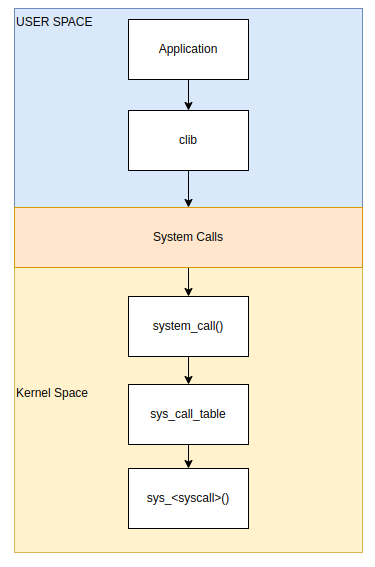

# System call

see [kernel-laps](https://linux-kernel-labs.github.io/refs/heads/master/lectures/syscalls.html), 

prepare and start the env qemu and debugger by following steps in [here](../prepareEnv/debugging_kernel.md), [Debug in linux using qemu] section

## Introduction

Kernel Offers a list of system calls that identifies the kernel interfaces. [linux system calls](https://man7.org/linux/man-pages/man2/syscalls.2.html)

All system calls are implemented in the kernel.

They are placed in a table and each system call have a specific number `__NR_<system call>`, Ex. see `linux/tools/include/uapi/asm-generic/unistd.h` 

They are implemented in  function `sys_<system call>()`, note multiple versions for the system call can exist, Ex. in [man syscall.2](https://man7.org/linux/man-pages/man2/syscalls.2.html)

```
there are three different versions of stat(2):
          sys_stat() (slot __NR_oldstat), sys_newstat() (slot
          __NR_stat), and sys_stat64() (slot __NR_stat64), with the last
          being the most current.  A similar story applies for lstat(2)
          and fstat(2).
```

System calls is the main interface between the kernel and the applications



### Exercise (Writing to a File Using System Calls in Linux (ARM Assembly))

To write to a file without using the C standard library (libc), you can use Linux system calls directly in ARM assembly. Below is an example demonstrating how to do this:

```asm
.section .data
    filename: .asciz "output.txt"
    text: .asciz "Hello, World!\n"
    text_len: .word . - text

.section .bss
    .lcomm fd, 4

.section .text
    .global _start

_start:
    // Open the file (syscall number 5)
    mov r7, #5                  // syscall number for sys_open
    ldr r0, =filename           // filename
    mov r1, #0101               // O_WRONLY | O_CREAT | O_TRUNC
    mov r2, #0600               // S_IRUSR | S_IWUSR
    svc #0
    str r0, fd                  // store the file descriptor

    // Write to the file (syscall number 4)
    mov r7, #4                  // syscall number for sys_write
    ldr r0, fd                  // file descriptor
    ldr r1, =text               // buffer
    ldr r2, =text_len           // buffer length
    ldr r2, [r2]
    svc #0

    // Close the file (syscall number 6)
    mov r7, #6                  // syscall number for sys_close
    ldr r0, fd                  // file descriptor
    svc #0

    // Exit (syscall number 1)
    mov r7, #1                  // syscall number for sys_exit
    mov r0, #0                  // exit code 0
    svc #0
```

### Explanation

1. **Data Section**: The `filename` and `text` are defined in the `.data` section. The length of the text is calculated using `.word`.
2. **BSS Section**: The file descriptor is reserved in the `.bss` section.
3. **Text Section**: The `_start` label marks the entry point of the program.
4. **Open the File**: The `sys_open` system call is invoked to open the file `output.txt` with write-only access. If the file does not exist, it is created with read and write permissions for the user. If it exists, it is truncated to zero length.
5. **Write to the File**: The `sys_write` system call writes the specified text to the file.
6. **Close the File**: The `sys_close` system call closes the file descriptor.
7. **Exit**: The `sys_exit` system call terminates the program.

This example demonstrates basic file operations using system calls in ARM assembly, bypassing the standard C library functions.

### Building and Executing the Assembly Code

To build and execute the ARM assembly code on your target system, follow these steps:

1. **Write the Assembly Code**: Save the provided assembly code to a file, for example, `write_file.s`.

2. **compile the Code**: Use the (`gcc`) to compile the code. Run the following command:
    ```sh
    arm-cortex_a8-linux-gnueabihf-gcc -o write_file.o write_file.s -nostartfiles
    ```

4. **Transfer the Executable to the Target System**: transfer the `write_file` executable to your target ARM system using any relevant method

5. **Set Execute Permissions**: On the target system, ensure the executable has the correct permissions to run. Use the following command:
    ```sh
    chmod +x write_file
    ```

6. **Execute the Program**: Run the executable on the target system:
    ```sh
    ./write_file
    ```

7. **Verify the Output**: Check the contents of `output.txt` to ensure the text "Hello, World!\n" has been written correctly. You can use `cat` to display the file contents:
    ```sh
    cat output.txt
    ```


# Qemu tracing system call