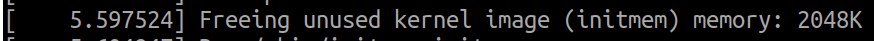
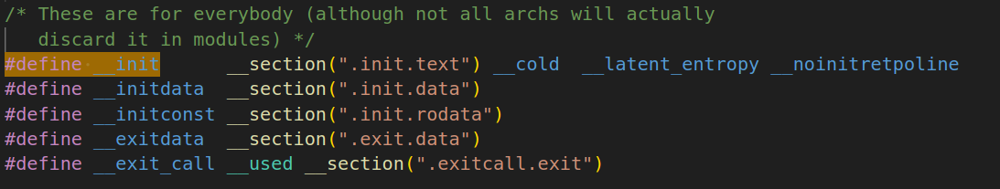

# Developing your first Module

## Intro

- A Module is a code written to be a part of kernel
- Extending Kernel with module allows:
  - extend kernel features in run time
  - fast startup of kernel, then loading extra features later
  - extending the kernel features when needed
    - Ex. load the module when specific network feature is needed

## Create your first module

create `hello.c` file 
```c
// SPDX-License-Identifier: GPL-2.0
/* hello.c */
#include <linux/init.h>
#include <linux/module.h>
#include <linux/kernel.h>
static int __init hello_init(void)
{
pr_alert("Good morrow to this fair assembly.\n");
return 0;
}
static void __exit hello_exit(void)
{
pr_alert("Alas, poor world, what treasure hast thou lost!\n");
}
module_init(hello_init);
module_exit(hello_exit);
MODULE_LICENSE("GPL");
MODULE_DESCRIPTION("Greeting module");
MODULE_AUTHOR("William Shakespeare");
```

- `module_init(hello_init);` macro to registers the function `hello_init` to be called when the module is **loaded** into the kernel.

-  `module_exit(hello_exit);` macro to registers the function `hello_exit` to be called when the module is **unloaded** into the kernel.

- `__init` compiler directive to place this function into specific section `.init`

  - This `.init` is removed after loading the module.

  - if module is compiled statically into kernel, it frees `.init` section, 

    - startup printk at the end of the linux startup

    

- `__exit` compiler directive to place this function into specific section, `__exit` section is removed if:

  - module compiled statically into kernel
  - module unloading is not enabled

- `include/linux/init.h`

- `MODULE_LICENSE()`, `MODULE_DESCRIPTION()` and `MODULE_AUTHOR()`, declare meta data about the module
  - try `modinfo` after loading the module 

create `makefile`

```makefile

# print the value of PROGS
ifneq ($(KERNELRELEASE),)
obj-m := $(PROGS)
else
KDIR := /home/dell/Desktop/Linux_course/Linux-yocto-Excersises/linux/code/bb/linux
# Source files
SRCS := $(wildcard *.c)
# Module object files
PROGS := $(SRCS:.c=.o)
all:
	$(MAKE) -C $(KDIR) M=$$PWD PROGS="$(PROGS)"
endif

clean:
	$(MAKE) -C $(KDIR) M=$$PWD clean

# Target to print the values of SRCS and PROGS
print-vars:
	@echo "SRCS = $(SRCS)"
	@echo "PROGS = $(PROGS)"
```


## Printk and log lvls in modules

Kernel logs can be logged to three different locations:
1. In kernel memory log buffer (always)  -> `/dev/kmsg`
2. non-volatile log files -> rsyslog & systemd `journalctl -k` 
3. In console device

configuration of printk of system lie in `/proc/sys/kernel/printk`
- try `cat /proc/sys/kernel/printk`

> 4 4 1 7

Those 4 numbers represents:

1. The current (console) log level
   - The implication being that all messages less than this value will appear on
   the console device!
2. The default level for messages that lack an explicit log level
3. The minimum allowed log level
4. The boot-time default log level 

#### Logging from a kernel module

create `printk_loglvl.c` file


```c
#include <linux/init.h>
#include <linux/module.h>
#include <linux/kernel.h>

MODULE_AUTHOR("<insert your name here>");
MODULE_DESCRIPTION("LKP book:ch4/printk_loglvl: print at each kernel log level");
MODULE_LICENSE("Dual MIT/GPL");
MODULE_VERSION("0.1");

static int __init printk_loglvl_init(void)
{
	pr_emerg("Hello, world @ log-level KERN_EMERG   [0]\n");
    printk(KERN_EMERG "Hello, world @ log-level KERN_EMERG   [0]\n");
	pr_alert("Hello, world @ log-level KERN_ALERT   [1]\n");
	pr_crit("Hello, world @ log-level KERN_CRIT    [2]\n");
	pr_err("Hello, world @ log-level KERN_ERR     [3]\n");
	pr_warn("Hello, world @ log-level KERN_WARNING [4]\n");
	pr_notice("Hello, world @ log-level KERN_NOTICE  [5]\n");
	pr_info("Hello, world @ log-level KERN_INFO    [6]\n");
	pr_debug("Hello, world @ log-level KERN_DEBUG   [7]\n");
	pr_devel("Hello, world via the pr_devel() macro"
		" (eff @KERN_DEBUG) [7]\n");

	return 0; /* success */
}

static void __exit printk_loglvl_exit(void)
{
	pr_info("Goodbye, world @ log-level KERN_INFO    [6]\n");
}

module_init(printk_loglvl_init);
module_exit(printk_loglvl_exit);

```

you can modify the makefile and add definition for this macro using:
    `CFLAGS_<filename>.o:=-DDEBUG` or `EXTRA_CFLAGS += -DDEBUG`

#### Going through logging code in the kernel

- check `printk.c`
- check variable `__log_buf`, `__LOG_BUF_LEN` and `CONFIG_LOG_BUF_SHIFT`
- note that this can be overriedden from [kernel cmdline](https://www.kernel.org/doc/html/v5.2/admin-guide/kernel-parameters.html)
    `log_buf_len=n [KMG]`
        Sets the size of the printk ring buffer,
        in bytes. n must be a power of two and greater
        than the minimal size. The minimal size is
- Note the implemtation of `pr_emerg` in printk.h
    ```c
    /**
     * pr_emerg - Print an emergency-level message
     * @fmt: format string
     * @...: arguments for the format string
     *
     * This macro expands to a printk with KERN_EMERG loglevel. It uses pr_fmt() to
     * generate the format string.
     */
    #define pr_emerg(fmt, ...) \
        printk(KERN_EMERG pr_fmt(fmt), ##__VA_ARGS__)
    ```

    `pr_emerg` equivalent to `printk(KERN_EMERG, "Hello, world @ log-level KERN_EMERG   [0]\n");`

- checking on macro `DEBUG` in `printk.h`

#### Cyclic printing

###### jiffies

- `jiffies` global variable in the linux that carry that counts the number of timer interrupts (or ticks) that have occurred since the system was booted.
- `HZ` configurable ticks (timer interrupts) per second ex. 100 ticks per second
- The number of seconds since boot can be calculated as `seconds = jiffies / HZ;`
- `jiffies` can be used in the system to:
    1. measure time intervals within the kernel, Ex. scheduling delays, timeouts, and system uptime
    2. preformance measurment

create `jiffies_example.c`
```c
#include <linux/module.h>
#include <linux/kernel.h>
#include <linux/jiffies.h>
#include <linux/init.h>
#include <linux/delay.h>

static int __init jiffies_example_init(void)
{
    printk(KERN_INFO "Jiffies: %lu\n", jiffies);
    printk(KERN_INFO "HZ: %d\n", HZ);
    printk(KERN_INFO "Seconds since boot: %lu\n", jiffies / HZ);
        
    msleep(5000);
    
    printk(KERN_INFO "Jiffies: %lu\n", jiffies);
    printk(KERN_INFO "HZ: %d\n", HZ);
    printk(KERN_INFO "Seconds since boot: %lu\n", jiffies / HZ);
    return 0;
}

static void __exit jiffies_example_exit(void)
{
    printk(KERN_INFO "Exiting Jiffies Example.\n");
}

module_init(jiffies_example_init);
module_exit(jiffies_example_exit);

MODULE_LICENSE("GPL");
MODULE_AUTHOR("Example");
MODULE_DESCRIPTION("Jiffies Example");
```

Note:
- To handle overflow, the kernel provides macros like `time_before()` and `time_after()`
- `schedule_timeout()` used to do delays in the kernel, Ex A delay of 5 seconds would be represented as:  
    
    ```c
    unsigned long delay = 5 * HZ;
    schedule_timeout(delay);
    ```
###### printk_ratelimited()
- it effectively suppresses regular prints when certain conditions are fulfilled.
- two kernel runtime configuration parameters (sysctl) in the path `/proc/sys/kernel/`:
    1. printk_ratelimit 
    2. printk_ratelimit_burst
- Ex. printk_ratelimit=5, printk_ratelimit_burst=10
    this means up to 10 instances of the same message occurring within a 5-second time interval can make it through before rate limiting kicks in.
- check `kernel/printk/sysctl.c` -> see the configuration parameters for the `printk_sysctls` 

#### linux loglevels & extra info
 - Try setting resetting the loglevel @ the start of the system by adding `loglevel=7` then `loglevel=1` in linux commandline and see the difference.
 - you can log to kernel messages using `echo "hello" > /dev/kmsg`


#### Printing format `pr_fmt`

- try adding this line to the \<module>.c file

 ```c
 #define pr_fmt(fmt) "%s:%s(): " fmt, KBUILD_MODNAME, __func__
 ```

- This should reformat your printing to be as follows:  

  - This is written in the code

    ```c
    pr_info("Test log message\n");
    ```

    

  - It should expand to 

    ```c
    printk(KERN_INFO "%s:%s(): Test log message\n", "my_module", "example_function");
    ```

    

  - then should be printed

    ```
    my_module:example_function(): Test log message
    ```
    
