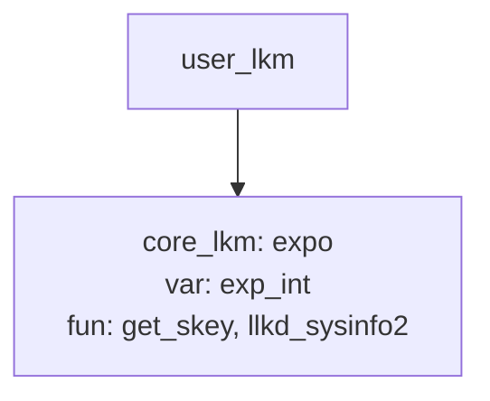

# Implementing Sysinfo Module 

## Module Stacking 

what if I need to call functions from another module





**core_lkm.c**

```c
#define pr_fmt(fmt) "%s:%s(): " fmt, KBUILD_MODNAME, __func__

#include <linux/init.h>
#include <linux/module.h>
#include <linux/kernel.h>

#define MODNAME   "core_lkm"
#define THE_ONE   0xfedface
MODULE_LICENSE("Dual MIT/GPL");

int exp_int = 200;
EXPORT_SYMBOL_GPL(exp_int);

/* Functions to be called from other LKMs */

/* llkd_sysinfo2:
 * A more security-aware version of the earlier llkd_sysinfo() routine. We use
 * David Wheeler's flawfinder(1) tool to detect possible vulnerabilities;
 * Based on it's report, we change the strlen, and replace the strncat with
 * strlcat.
 */
void llkd_sysinfo2(void)
{
#define MSGLEN   128
	char msg[MSGLEN];

	memset(msg, 0, MSGLEN);
	snprintf(msg, 48, "%s(): minimal Platform Info:\nCPU: ", __func__);

	/* Strictly speaking, all this #if... is considered ugly and should be
	 * isolated as far as is possible
	 */
#ifdef CONFIG_X86
#if (BITS_PER_LONG == 32)
	strlcat(msg, "x86_32, ", MSGLEN);
#else
	strlcat(msg, "x86_64, ", MSGLEN);
#endif
#endif
#ifdef CONFIG_ARM
	strlcat(msg, "ARM-32, ", MSGLEN);
#endif
#ifdef CONFIG_ARM64
	strlcat(msg, "Aarch64, ", MSGLEN);
#endif
#ifdef CONFIG_MIPS
	strlcat(msg, "MIPS, ", MSGLEN);
#endif
#ifdef CONFIG_PPC
	strlcat(msg, "PowerPC, ", MSGLEN);
#endif
#ifdef CONFIG_S390
	strlcat(msg, "IBM S390, ", MSGLEN);
#endif

#ifdef __BIG_ENDIAN
	strlcat(msg, "big-endian; ", MSGLEN);
#else
	strlcat(msg, "little-endian; ", MSGLEN);
#endif

#if (BITS_PER_LONG == 32)
	strlcat(msg, "32-bit OS.\n", MSGLEN);
#elif(BITS_PER_LONG == 64)
	strlcat(msg, "64-bit OS.\n", MSGLEN);
#endif
	pr_info("%s", msg);
}
EXPORT_SYMBOL(llkd_sysinfo2);

#if (BITS_PER_LONG == 32)
u32 get_skey(int p)
#else				// 64-bit
u64 get_skey(int p)
#endif
{
#if (BITS_PER_LONG == 32)
	u32 secret = 0x567def;
#else				// 64-bit
	u64 secret = 0x123abc567def;
#endif
	pr_info("%s:%d: I've been called\n", __FILE__, __LINE__);
	if (p == THE_ONE)
		return secret;
	return 0;
}
EXPORT_SYMBOL(get_skey);

static int __init core_lkm_init(void)
{
	pr_info("inserted\n");
	return 0;	/* success */
}

static void __exit core_lkm_exit(void)
{
	pr_info("bids you adieu\n");
}

module_init(core_lkm_init);
module_exit(core_lkm_exit);
```


**user_lkm.c**

```c
#define pr_fmt(fmt) "%s:%s(): " fmt, KBUILD_MODNAME, __func__

#include <linux/init.h>
#include <linux/module.h>
#include <linux/kernel.h>

#define MODNAME     "user_lkm"
#if 1
MODULE_LICENSE("Dual MIT/GPL");
#else
MODULE_LICENSE("MIT");
#endif

extern void llkd_sysinfo2(void);
extern long get_skey(int);
extern int exp_int;

/* Call some functions within the 'core' module */
static int __init user_lkm_init(void)
{
#define THE_ONE   0xfedface
	pr_info("inserted\n");
	u64 sk = get_skey(THE_ONE);

	pr_debug("Called get_skey(), ret = 0x%llx = %llu\n", sk, sk);
	pr_debug("exp_int = %d\n", exp_int);
	llkd_sysinfo2();

	return 0;
}

static void __exit user_lkm_exit(void)
{
	pr_info("bids you adieu\n");
}

module_init(user_lkm_init);
module_exit(user_lkm_exit);
```


## Module parameters

**modparams1.c**

```c
#include <linux/init.h>
#include <linux/module.h>
#include <linux/kernel.h>

#define OUR_MODNAME    "modparams1"
MODULE_AUTHOR("Kaiwan N Billimoria");
MODULE_DESCRIPTION("LKP book:ch5/modparams/modparams1: module parameters demo LKM #1");
MODULE_LICENSE("Dual MIT/GPL");
MODULE_VERSION("0.1");

/* Module parameters */
static int mp_debug_level;
module_param(mp_debug_level, int, 0660);
MODULE_PARM_DESC(mp_debug_level,
"Debug level [0-2]; 0 => no debug messages, 2 => high verbosity");

static char *mp_strparam = "My string param";
module_param(mp_strparam, charp, 0660);
MODULE_PARM_DESC(mp_strparam, "A demo string parameter");

static int __init modparams1_init(void)
{
	pr_info("%s: inserted\n", OUR_MODNAME);
	pr_info("module parameters passed: mp_debug_level=%d mp_strparam=%s\n",
		mp_debug_level, mp_strparam);
	return 0;		/* success */
}

static void __exit modparams1_exit(void)
{
	pr_info("module parameters passed: mp_debug_level=%d mp_strparam=%s\n",
		mp_debug_level, mp_strparam);
	pr_info("%s: removed\n", OUR_MODNAME);
}

module_init(modparams1_init);
module_exit(modparams1_exit);
```


- see how module parameters are initialized using **module_param**, check it in `moduleparam.h`
- how those parameters can be changed from `/sys/module/modprams/parameters/`, list files in this folder, `cat` and write to those files 
- this techniques can be used for setting debug_level in runtime 
- you can mandate on user to set specific parameters by failing if those parameters are not set like the upcoming example

**modparams2.c**

```c
#include <linux/init.h>
#include <linux/module.h>
#include <linux/kernel.h>

#define OUR_MODNAME    "modparams2"
MODULE_AUTHOR("Kaiwan N Billimoria");
MODULE_DESCRIPTION("LKP book:ch5/modparams/modparams2: module parameters");
MODULE_LICENSE("Dual MIT/GPL");
MODULE_VERSION("0.1");

/* Module parameters */
static int mp_debug_level;
module_param(mp_debug_level, int, 0660);
MODULE_PARM_DESC(mp_debug_level,
		 "Debug level [0-2]; 0 => no debug messages, 2 => high verbosity");

static char *mp_strparam = "My string param";
module_param(mp_strparam, charp, 0660);
MODULE_PARM_DESC(mp_strparam, "A demo string parameter");

static int control_freak;
module_param(control_freak, int, 0660);
MODULE_PARM_DESC(control_freak, "Set to the project's control level [1-5]. MANDATORY");

static int __init modparams2_init(void)
{
	pr_info("%s: inserted\n", OUR_MODNAME);
	if (mp_debug_level > 0)
		pr_info("module parameters passed: "
			"mp_debug_level=%d mp_strparam=%s\ncontrol_freak=%d\n",
			mp_debug_level, mp_strparam, control_freak);

	/* param 'control_freak': if it hasn't been passed (implicit guess), or is
	 * the same old value, or isn't within the right range,
	 * it's Unacceptable!  :-)
	 */
	if ((control_freak < 1) || (control_freak > 5)) {
		pr_warn("%s: Must pass along module parameter"
			" 'control_freak', value in the range [1-5]; aborting...\n",
			OUR_MODNAME);
		return -EINVAL;
	}
	return 0;		/* success */
}

static void __exit modparams2_exit(void)
{
	if (mp_debug_level > 0)
		pr_info("module parameters passed: mp_debug_level=%d mp_strparam=%s\n",
			mp_debug_level, mp_strparam);
	pr_info("%s: removed\n", OUR_MODNAME);
}

module_init(modparams2_init);
module_exit(modparams2_exit);
```

