# what is a process ? 

A **process** is an instance of an executing program

A **program** is a file containing information how to construct a process in runtime

Program contain:

- Binary format identification -> **[elf file header](https://en.wikipedia.org/wiki/Executable_and_Linkable_Format)** `readelf -h`

- Machine-language instructions: .text

- Program entry-point address: main(), __start

- Data: .rodata, .data

- Symbol and relocation tables: addresses of symbols and unlinked symbols

- Shared-library and dynamic-linking information: `readelf -d`

  

use `readelf` to see different parts of the elf

`readelf -S <executable>` to see different sections of the program


# Process in Execution 

## Virtual Memory 

- when a process is started it looks in the memory like upcoming picture

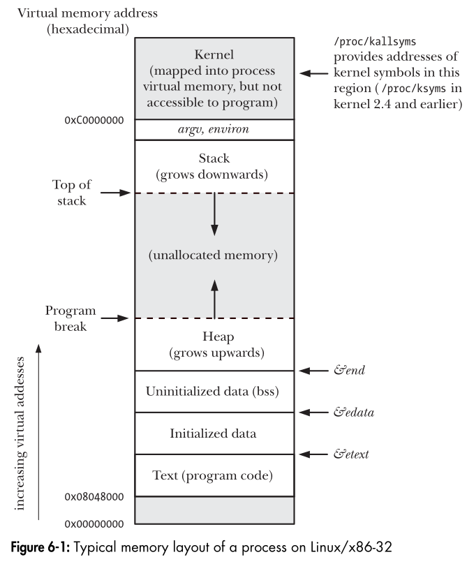

- `cat /dev/kallsyms` print all addresses of the kernel symbols, (on beaglebone note that they are all above 0xc0000000) 3GB (user) - 1GB (kernel) configuration for 32-bit device

- each process while executing sees the whole 3GB as it's own memory (virtual memory)

  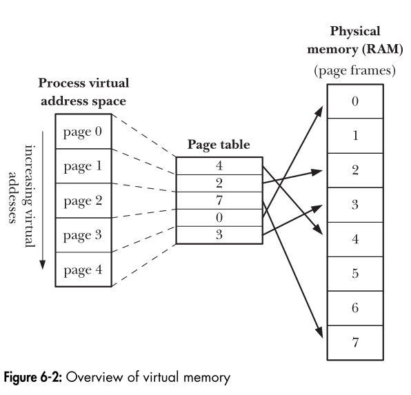

- Pages are not in the physical memory until they are used

- Virtual memory allows:

  - To Isolated the processes from each other 
  - Allow Processes to share read only parts -> shared libraries
  - Allow Processes to share memory regions to share data, `shmget()`, `mmap()` 
  - You can exceed the physical RAM size with this concept.
  - Allow different  process to have different  protections on the memory

  

## Command-line Arguments (argc, argv) and Environment Variables

### cmdline

When the program is executed, the command-line arguments (the separate words parsed by the shell) are made available via two arguments to the function `main(int argc, char *argv[])`. 

1.  `int argc`, indicates how many command-line arguments there are. 
2. `char *argv[]`, is an array of pointers to the command-line arguments, each of which is a null-termi-
   nated character string.

`cat /proc/<pid>/cmdline` gives you the command you issued to start the program, including cmdline args

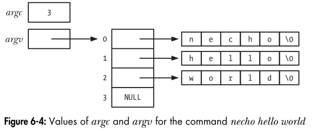

```c
#include <stdio.h>

int main(int argc, char *argv[])
{
int j;
for (j = 0; j < argc; j++)
	printf("argv[%d] = %s\n", j, argv[j]);
exit(0);
}
```

args and envs is stored in the virtual address space of the process (look @ 0xc0000000)

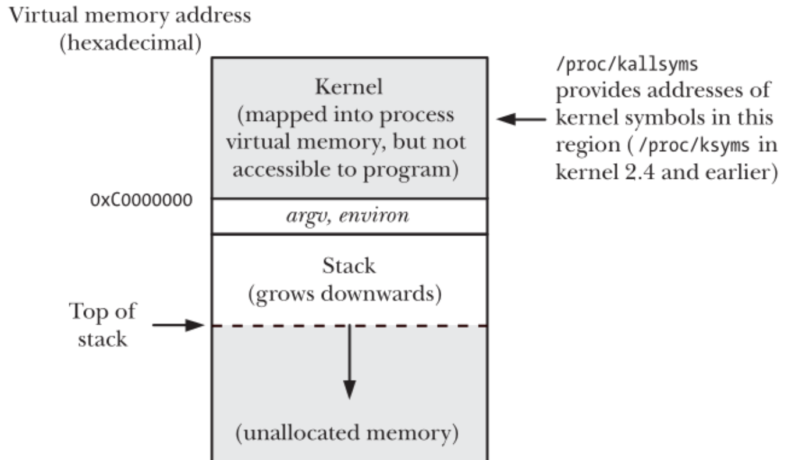

### Environment Varaibles

Each process has an associated array of strings called the environment list, or simplythe environment. Each of these strings is a definition of the form **name=value**.

This List is copied from the parent process to the child process -> can be used to communicate some values to the child process

you can access those environment variables from code, the environment list can be accessed using the global variable `char **environ`. (The C run-time startup code defines this variable and assigns the
location of the environment list to it.)

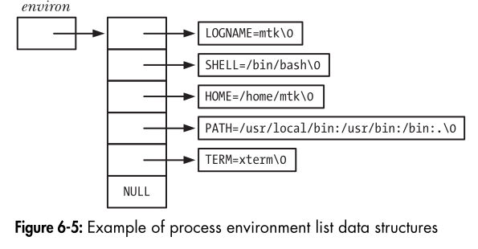

```c
extern char **environ;
int main(int argc, char *argv[])
{
char **ep;
for (ep = environ; *ep != NULL; ep++)
	puts(*ep);
exit(0);
}
```

also there is functions in the `#include <stdlib.h>` that can be used to modify the env variables like

`getenv()`, `setenv()`, ... etc


### Process Information

For each process the kernel carry information about it, to use it later for scheduling, ipc, permissions, ... etc.

You can see this information in `/proc/<pid>/` like:

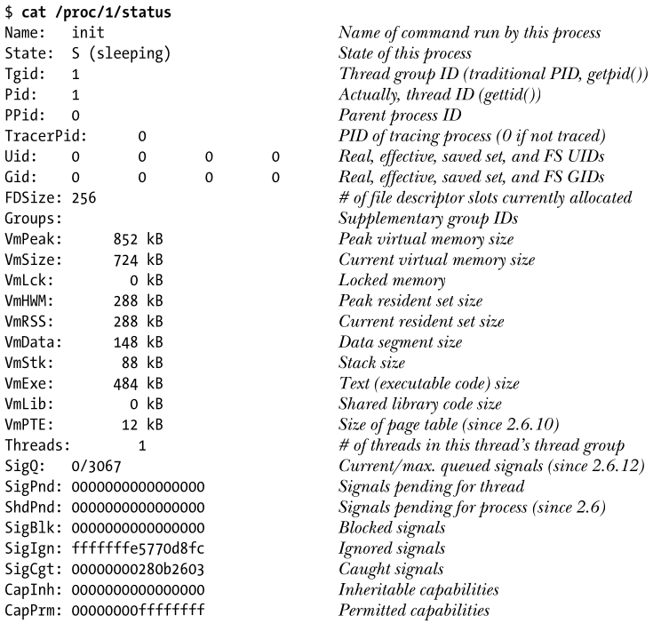

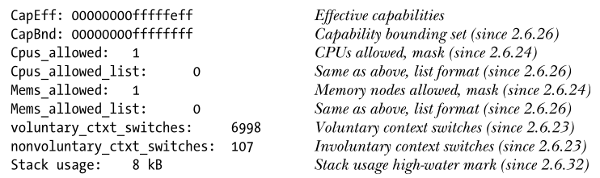

and in 

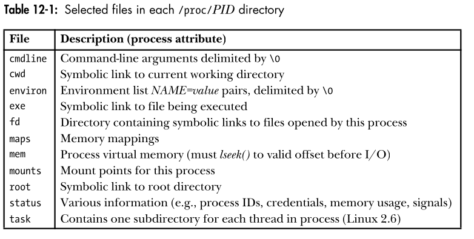

## Creating a Process

Creating a new process in Linux can be done using the `fork()` system call. The `fork()` system call creates a new process by duplicating the calling process. The new process is referred to as the child process.

### Example of Creating a Process:

```c
#include <stdio.h>
#include <unistd.h>
#include <sys/types.h>

int main() {
    pid_t pid = fork();

    if (pid < 0) {
        // Fork failed
        perror("fork");
        return 1;
    } else if (pid == 0) {
        // Child process
        printf("This is the child process with PID: %d\n", getpid());
    } else {
        // Parent process
        printf("This is the parent process with PID: %d\n", getpid());
    }

    return 0;
}
```

In this example, the `fork()` system call creates a new child process. Both the parent and child processes will execute the code following the `fork()` call.

## Creating Threads

Creating threads in Linux can be done using the POSIX thread (pthread) library. Threads allow multiple sequences of instructions to run concurrently within the same process.

### Example of Creating Threads:

```c
#include <stdio.h>
#include <stdlib.h>
#include <pthread.h>

// you can use mutex for protect the variable against concurrent access
int global_var = 0;

void *thread_function(void *arg) {
    int thread_num = *(int *)arg;
    printf("Thread %d is running\n", thread_num);

    // Access and modify the global variable
    global_var++;
    printf("Thread %d incremented global_var to %d\n", thread_num, global_var);

    return NULL;
}

int main() {
    pthread_t threads[2];
    int thread_args[2];
    int result_code;

    for (int i = 0; i < 2; i++) {
        thread_args[i] = i;
        result_code = pthread_create(&threads[i], NULL, thread_function, &thread_args[i]);
        if (result_code) {
            printf("Error creating thread %d, return code: %d\n", i, result_code);
            exit(EXIT_FAILURE);
        }
    }

    for (int i = 0; i < 2; i++) {
        pthread_join(threads[i], NULL);
    }

    printf("All threads completed\n");
    return 0;
}
```

In this example, two threads are created using `pthread_create()`. Each thread runs the `thread_function` concurrently. The `pthread_join()` function is used to wait for the threads to complete.

These examples demonstrate how to create processes and threads in Linux, allowing for concurrent execution of code.

# Kernel Task-Structure

For each thread in the User space the Kernel creates a `task_struct` & kernel stack in the Kernel space.

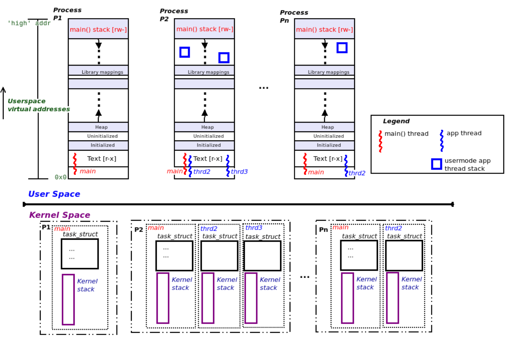

Threads are light weight process.

Threads is the entity to be scheduled in the Kernel.

The task structure is represented in kernel code as `include/linux/sched.h`, see `struct task_struct`.

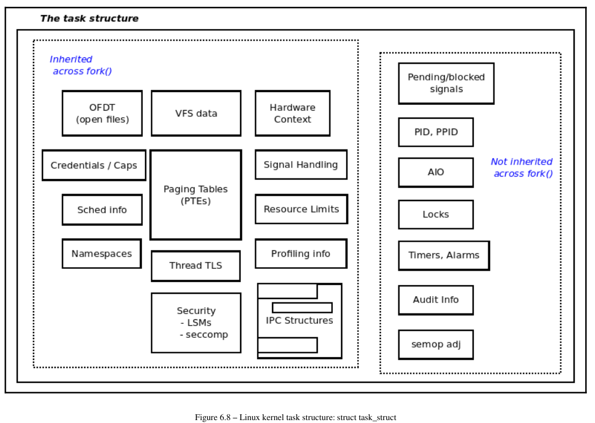


# Kernel Entry Points

Kernel can be entered from one of two context:

- Process context
  - User Space system Call
  - Kernel Threads
- Interrupt context

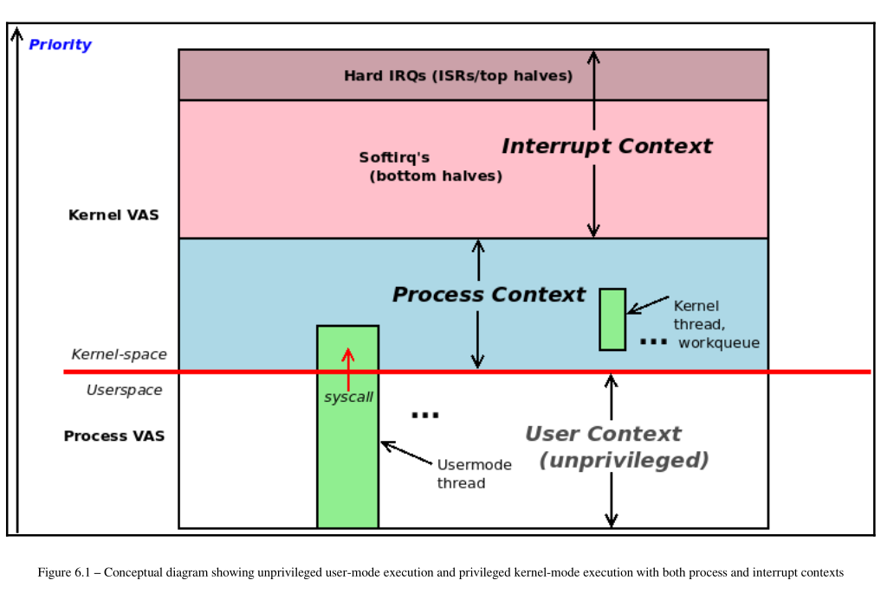

Under which context do the modules go ? 


# Kernel Threads

Kernel threads are special types of threads that run in the kernel space. 

Kernel threads have direct access to kernel data structures and can perform tasks that require higher privileges.

They are used for various background tasks within the kernel, such as handling interrupts, performing periodic tasks, or managing hardware.

### Key Characteristics of Kernel Threads:

1. **Run in Kernel Space**: Kernel threads operate in the kernel space, allowing them to perform low-level operations that user-space threads cannot.
2. **Created with `kthread_create` or `kthread_run`**: These functions are used to create and start kernel threads.
3. **Managed by the Kernel**: The kernel scheduler manages the execution of kernel threads, just like it does for user-space threads.
4. **Can Be Stopped**: Kernel threads can be stopped using `kthread_stop`.

### Example of a Kernel Thread:

```c
#include <linux/module.h>
#include <linux/kernel.h>
#include <linux/kthread.h>
#include <linux/delay.h>

static struct task_struct *task;

static int thread_fn(void *data)
{
    while (!kthread_should_stop()) {
        printk(KERN_INFO "Kernel thread running\n");
        ssleep(5); // Sleep for 5 seconds
    }
    return 0;
}

static int __init my_module_init(void)
{
    task = kthread_run(thread_fn, NULL, "my_kernel_thread");
    if (IS_ERR(task)) {
        printk(KERN_ERR "Failed to create kernel thread\n");
        return PTR_ERR(task);
    }
    return 0;
}

static void __exit my_module_exit(void)
{
    if (task) {
        kthread_stop(task);
    }
}

module_init(my_module_init);
module_exit(my_module_exit);

MODULE_LICENSE("GPL");
MODULE_AUTHOR("Your Name");
MODULE_DESCRIPTION("Example of a kernel thread");
```

### `schedule_timeout`:

`schedule_timeout` is a function used to put the current task to sleep for a specified period. It is often used in kernel threads to implement delays or timeouts.

### Key Points about `schedule_timeout`:

1. **Takes a Timeout in Jiffies**: The function takes a timeout value in jiffies (the basic unit of time in the Linux kernel).
2. **Changes Task State**: Before calling `schedule_timeout`, you should set the task state to `TASK_INTERRUPTIBLE` or `TASK_UNINTERRUPTIBLE`.
3. **Can Be Interrupted**: If the task state is `TASK_INTERRUPTIBLE`, the sleep can be interrupted by signals.

### Example of `schedule_timeout`:

```c
#include <linux/module.h>
#include <linux/kernel.h>
#include <linux/kthread.h>
#include <linux/jiffies.h>

static struct task_struct *task;

static int thread_fn(void *data)
{
    long timeout = msecs_to_jiffies(5000); // 5 seconds timeout

    printk(KERN_INFO "Thread going to sleep for 5 seconds using schedule_timeout... jiffies=%lu\n", jiffies);

    // Sleep for the specified timeout
    set_current_state(TASK_INTERRUPTIBLE);
    schedule_timeout(timeout);

    if (kthread_should_stop()) {
        printk(KERN_INFO "Thread was interrupted and stopped... jiffies=%lu\n", jiffies);
        return 0;
    }

    printk(KERN_INFO "Thread woke up after 5 seconds... jiffies=%lu\n", jiffies);

    return 0;
}

static int __init my_module_init(void)
{
    task = kthread_run(thread_fn, NULL, "example_thread");
    if (IS_ERR(task)) {
        printk(KERN_ERR "Failed to create kernel thread.\n");
        return PTR_ERR(task);
    }
    return 0;
}

static void __exit my_module_exit(void)
{
    if (task) {
        kthread_stop(task);
    }
}

module_init(my_module_init);
module_exit(my_module_exit);

MODULE_LICENSE("GPL");
MODULE_AUTHOR("Your Name");
MODULE_DESCRIPTION("Example of schedule_timeout usage");
```

In this example, the kernel thread sleeps for 5 seconds using `schedule_timeout`. If the thread is interrupted, it will stop and print a message.


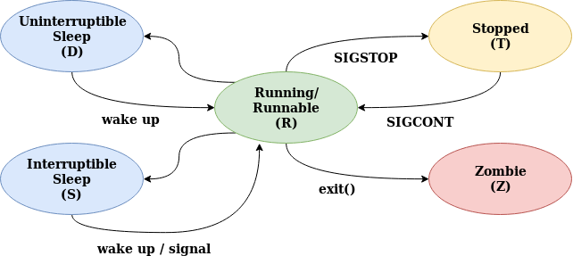

A **kernel thread** (or a normal process) can be in any of the following process states: running, interruptible, uninterpretable, zombie, stopped, traced, or dead. These states are defined in `include/linux/sched.h`:
A process in the running state (**TASK_RUNNING**) is in the scheduler run queue and is a candidate for getting CPU time allotted by the scheduler.
A task in the interruptible state (**TASK_INTERRUPTIBLE**) is waiting for an event to occur and is not in the scheduler run queue. When the task gets woken up, or if a signal is delivered to it, it re-enters the run queue.
The uninterruptible state (**TASK_UNINTERRUPTIBLE**) is similar to the interruptible state except that receipt of a signal will not put the task back into the run queue.
A stopped task (**TASK_STOPPED**) has stopped execution due to receipt of certain signals.
If an application such as strace is using the ptrace support in the kernel to intercept a task, it'll be in the traced state (**TASK_TRACED**).
A task in the zombie state (**EXIT_ZOMBIE**) has terminated, but its parent did not wait for the task to complete. 

An exiting task is either in the **EXIT_ZOMBIE** state or the dead (**EXIT_DEAD**) state

# Accessing Kernel Internals (task list)

As mentioned earlier, all the task structures are organized in kernel memory in a
linked list called the task list (allowing them to be iterated over).

You can easily iterate over various lists concerned with tasks via conveniently
provided macros in the `include/linux/sched/signal.h` header file.

see `for_each_process`

## Iterate over the kernel task list and display all processes alive.

```c
/*
 * ch6/foreach/prcs_showall.c
 ***************************************************************
 * This program is part of the source code released for the book
 *  "Linux Kernel Programming"
 *  (c) Author: Kaiwan N Billimoria
 *  Publisher:  Packt
 *  GitHub repository:
 *  https://github.com/PacktPublishing/Linux-Kernel-Programming
 *
 * From: Ch 6 : Kernel and MM Internals - Essentials
 ****************************************************************
 * Brief Description:
 * This kernel module iterates over the task structures of all *processes*
 * currently alive on the box, printing out a few details for each of them.
 * We use the for_each_process() macro to do so here.
 *
 * For details, please refer the book, Ch 6.
 */
#include <linux/init.h>
#include <linux/module.h>
#include <linux/kernel.h>
#include <linux/sched.h>

#include <linux/version.h>
#if LINUX_VERSION_CODE > KERNEL_VERSION(4, 10, 0)
#include <linux/sched/signal.h>	/* for_each_xxx(), ... */
#endif
#include <linux/fs.h>		/* no_llseek() */
#include <linux/slab.h>
#include <linux/uaccess.h>	/* copy_to_user() */
#include <linux/kallsyms.h>

#define OURMODNAME	"prcs_showall"

MODULE_AUTHOR("Kaiwan N Billimoria");
MODULE_DESCRIPTION("LKP book:ch6/foreach/prcs_showall: "
"Show all processes by iterating over the task list");
MODULE_LICENSE("Dual MIT/GPL");
MODULE_VERSION("0.1");

static int show_prcs_in_tasklist(void)
{
	struct task_struct *p;
#define MAXLEN   128
	char tmp[MAXLEN];
	int numread = 0, n = 0, total = 0;
	char hdr[] = "     Name       |  TGID  |   PID  |  RUID |  EUID";

	pr_info("%s\n", &hdr[0]);
	/*
	 * The for_each_process() is a macro that iterates over the task structures in memory.
	 * The task structs are global of course; this implies we should hold a lock of some
	 * sort while working on them (even if only reading!). So, doing
	 *  read_lock(&tasklist_lock);
	 *  [...]
	 *  read_unlock(&tasklist_lock);
	 * BUT, this lock - tasklist_lock - isn't exported and thus unavailable to modules.
	 * So, using an RCU read lock is indicated here (this has been added later to this code).
	 * FYI: a) Ch 12 and Ch 13 cover the details on kernel synchronization.
	 *      b) Read Copy Update (RCU) is a complex synchronization mechanism; it's
	 * conceptually explained really well within this blog article:
	 *  https://reberhardt.com/blog/2020/11/18/my-first-kernel-module.html
	 */
	rcu_read_lock();
	for_each_process(p) {
		memset(tmp, 0, 128);
		n = snprintf(tmp, 128, "%-16s|%8d|%8d|%7u|%7u\n", p->comm, p->tgid, p->pid,
			     /* (old way to disp credentials): p->uid, p->euid -or-
			      *	current_uid().val, current_euid().val
				  * better way using kernel helper __kuid_val():
			      */
			     __kuid_val(p->cred->uid), __kuid_val(p->cred->euid)
		    );
		numread += n;
		pr_info("%s", tmp);
		//pr_debug("n=%d numread=%d tmp=%s\n", n, numread, tmp);

		cond_resched();
		total++;
	}			// for_each_process()
	rcu_read_unlock();

	return total;
}

static int __init prcs_showall_init(void)
{
	int total;

	pr_info("%s: inserted\n", OURMODNAME);
	total = show_prcs_in_tasklist();
	pr_info("%s: total # of processes on system: %d\n", OURMODNAME, total);

	return 0;		/* success */
}

static void __exit prcs_showall_exit(void)
{
	pr_info("%s: removed\n", OURMODNAME);
}

module_init(prcs_showall_init);
module_exit(prcs_showall_exit);
```

`cond_resched()` is a macro or function that checks if the current kernel thread should yield the CPU voluntarily to allow other threads to run.

 `rcu_read_lock()` is a function used to protect **read-side critical sections**

- RCU allows multiple readers to access data concurrently without blocking, while writers can safely update or delete data structures without interfering with active readers.

