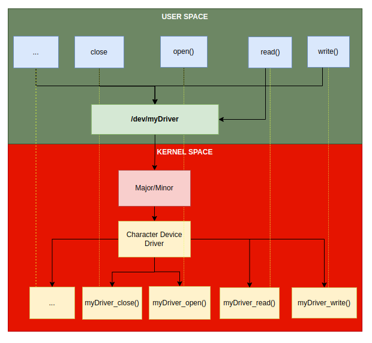

# Character Device Driver

## Intro

- A **device driver** provides **entry points** into the kernel through file-related system calls like `open()`, `read()`, `write()`, `llseek()`, `close()`, ...etc. 

- Each device will be abstracted by a file, a **device file**, or **device node** (`/dev/`)

- Each file have a type, major and minor number that identify this device 

  - type can be character or block.
  - major: identifies the device type (IDE disk, SCSI disk, serial port, etc.).
  - minor: identifies the device  (first disk, second serial port, etc.).

- see image below
  

- Drivers use 3 important structures:

  1. `struct file_operations`
  2. `struct file` 
  3. `struct inode`.

- All possible file operations functions are mentioned in `include/linux/fs.h` in `file_operations` structure

  ```c
  #include <linux/fs.h>
  
  struct file_operations {
      struct module *owner;
      loff_t (*llseek) (struct file *, loff_t, int);
      ssize_t (*read) (struct file *, char __user *, size_t, loff_t *);
      ssize_t (*write) (struct file *, const char __user *, size_t, loff_t *);
      [...]
      long (*unlocked_ioctl) (struct file *, unsigned int, unsigned long);
      [...]
      int (*open) (struct inode *, struct file *);
      int (*flush) (struct file *, fl_owner_t id);
      int (*release) (struct inode *, struct file *);
      [...]
  ```

- Most parameters for the presented operations have a direct meaning:

  - `file` and `inode` identifies the device type file;
  - `size` is the number of bytes to be read or written;
  - `offset` is the displacement to be read or written (to be updated accordingly);
  - `user_buffer` user buffer from which it reads / writes;
  - `whence` is the way to seek (the position where the search operation starts);
  - `cmd` and `arg` are the parameters sent by the users to the ioctl call (IO control).


#### `inode` and `file` structures[¶](https://linux-kernel-labs.github.io/refs/heads/master/labs/device_drivers.html#inode-and-file-structures)

An `inode` represents a file from the point of view of the file system. Attributes of an inode are the size, rights, times associated with the file. An inode uniquely identifies a file in a file system.

The `file` structure is still a file, but closer to the user's point of view. From the attributes of the file structure we list: 

- the inode, 
- the file name, 
- the file opening attributes, 
- the file position. 

All open files at a given time have associated a `file` structure.

The file structure contains, among many fields:

- `f_mode`, which specifies read (`FMODE_READ`) or write (`FMODE_WRITE`);

 - `f_flags`, which specifies the file opening flags (`O_RDONLY`, `O_NONBLOCK`, `O_SYNC`, `O_APPEND`, `O_TRUNC`, etc.);
 - `f_op`, which specifies the operations associated with the file (pointer to the `file_operations` structure );
 - `private_data`, a pointer that can be used by the programmer to store device-specific data; The pointer will be initialized to a memory location assigned by the programmer.
 - `f_pos`, the offset within the file

The `inode` structure contains, among much information, an `i_cdev` field, which is a pointer to the structure that defines the character device (when the inode corresponds to a character device).